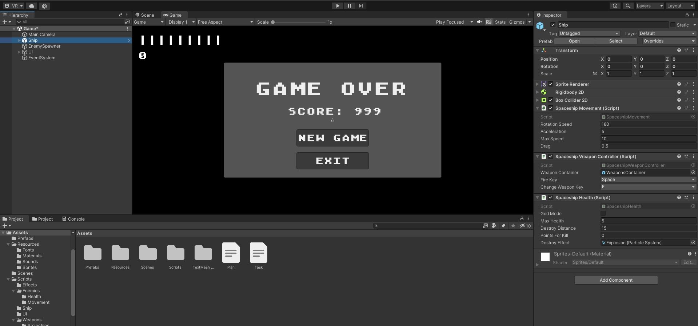

# Тестовое задание Unity “Asteroids 1979”
Задача: разработать клон игры Asteroids. Классический Asteroids был разработан 
в 1979 году в компании Atari для игровых автоматов.  
Игровой мир представляет 
собой часть космоса, в которой пользователь управляет космическим кораблем, 
смотря на него сверху. Корабль перемещается в области экрана, не выходя 
за его пределы (сталкиваясь с границами при их достижении).   
В сцене присутствуют также дрейфующие астероиды и комические тарелки. 
Первые имеют разнообразный в определенных пределах размер, кроме того, 
они могут перемещаться в любом направлении с различной (в разумных границах)
скоростью. При столкновении с астероидами космический корабль взрывается 
(или погибает).   После своего появления в игровой 
сцене летающие тарелки всегда преследуют космический корабль и если догоняют, 
то уничтожают его. 

У космического корабля есть два вида оружия: пули и лазер. Запас пуль бесконечен. 
С их помощью НЛО можно подбить одним выстрелом, а если ими попасть по астероиду, 
то он раскалывается на два меньших куска, 
продолжающих дрейфовать в космическом пространстве с произвольно выбранной 
скоростью и направлением. 
Эти части полноценного астероида при следующем попадании уничтожаются с первого раза.  
Второй тип оружия — лазер. Он должен иметь лимит на количество выстрелов: 
изначально у корабля есть десять лазерных выстрелов. Когда игрок их истратит, 
запас лазерного оружия медленно восполняется. С помощью лазера и астероиды,
и летающие тарелки уничтожаются с одного попадания.  

Каждый астероид сталкивается друг с другом и соответственно меняет направление движения.
В игре надо реализовать специальные эффекты (particle effects), 
служащие для визуализации различных взрывов.  
Кроме этого, надо реализовать GUI. В него должны входить в качестве HUD’а:
текстовые надписи, показывающие набранные очки, которые увеличиваются 
в момент поражения астероидов и тарелок, и количество лазерных снарядов 
(самовосстанавливающееся значение).  

Когда геймерский корабль терпит крушение, надо вывести окно, в
котором будет показано количество набранных очков, и предоставить
игроку выбор между началом игры заново и выходом, то есть закрытием приложения.

Арт не предоставляется, 
весь контент для игры нужно нарисовать самому или
использовать свободный.

## Скриншот игры в редакторе:

## Установка:

1. Склонируйте репозиторий проекта на свое устройство.
2. Откройте проект в Unity (2021.3.16f1).
3. Соберите и запустите проект на вашем устройстве.

## Использование:

- Используйте клавиши WASD или стрелки для перемещения космического корабля.
- Нажмите клавишу E для переключения между различными видами оружия.
- Нажмите пробел для выстрела.
- Выживайте как можно дольше, побеждая астероиды и летающие тарелки.

## API:

## SpaceshipMovement:

Класс SpaceshipMovement отвечает за движение космического корабля в игре.

### Поля

- `maxSpeed`: Максимальная скорость перемещения.
- `rotationSpeed`: Скорость поворота.
- `acceleration`: Ускорение.

## SpaceshipWeaponController:

Класс SpaceshipWeaponController отвечает за управление оружием космического корабля. 
Он позволяет стрелять пулями и лазерами, а также осуществлять переключение 
между различными видами оружия.

### Поля

- `weaponContainer`: Контейнер со всем доступным оружием космического корабля.
- `fireKey`: Клавиша выстрела.
- `changeWeaponKey`: Клавиша смены оружия.

## Health:

Класс Health представляет собой компонент, отвечающий за управление здоровьем 
объекта в игре.

### Поля

- `godMode`: Параметр для тестирования. Урон наносится, но объект не погибает.
- `maxHealth`: Максимальное значение здоровья объекта.
- `destroyDistance`: Дистанция на которой объекты будут автоматически уничтожены.
- `pointsForKill`: Количество очков, которое будет начислено за убийство объекта.
- `destroyEffect`: Префаб эффекта убийства.
  
### События

- `OnEnemyDestroyed`: Событие, вызываемое при смерти объекта.

### Методы

- `TakeDamage`: Метод TakeDamage принимает количество урона,
которое должно быть нанесено объекту. Метод уменьшает текущее значение здоровья 
на указанное количество. Если значение здоровья становится меньше или равно нулю,
происходит смерть объекта.

## Damage:

Класс Damage представляет собой компонент, отвечающий за нанесение урона объектам в игре.

### Поля

- `damage`: Количество урона, наносимого объектом.
- `playerIsTarget`: Определяет группы враги / игроки.

##  Weapon:

Абстрактный класс Weapon представляет базовый функционал для оружия.

### Поля

- `projectilePrefab`: Префаб снаряда.

### Методы

- `Fire`: Производит выстрел.

## EnemyMovement:

Абстрактный класс EnemyMovement предоставляет базовый функционал для движения врагов в игре.

### Поля и свойства

- `minMovementSpeed`: Минимальная скорость врага.
- `maxMovementSpeed`: Максимальная скорость врага.
- `spreadAngle`: Максимальный угол при произвольном выборе направления движения.
- `Target`: Целевой объект, к которому монстр движется.

## Asteroid:

Класс Asteroid задает размеры и массу созданного астероида.

### Поля

- `minSize`: Минимальный размер астероида.
- `maxSize`: Максимальный размер астероида.

## EnemySpawner:

Класс EnemySpawner отвечает за спавн врагов в игре.

### Поля

- `player`: Трансформ игрока, используется для задания цели некоторым врагам.
- `dataList`: Лист объектов класса EnemySpawnData, содержащих информацию для спавна.
- `uiController`: Ссылка на контроллер интерфейса игры.

### Внутренный класс
- `EnemySpawnData`: Содержит префаб врага и интервал с которым враг должен спавниться.

## UIController:

Класс UIController управляет отображением пользовательского интерфейса в игре. 
Он содержит ссылки на текст для отображения количества
очков, количество зарядов лазера и объект для отображения экрана проигрыша.

### Поля

- `scoreText`: Текст для отображения количества очков.
- `laserAmmoText`: Текст для отображения зарядов лазера.
- `gameOverUI`: Экран проигрыша.
### Методы

- `UpdateScore`: Увеличивает количество набранных очков на заданное количество 
и обновляет текстовое отображение.
- `UpdateAmmo`: Обновляет значение количества зарядов лазера и обновляет значение на экране.
- `GameOver`: Включает экран проигрыша.

___
## Контакты:
[LinkedIn: **ryabchenko**](https://www.linkedin.com/in/ryabchenko)  
[Telegram: **whyv2**](https://t.me/whyv2)    
[Email: **00bl@bk.ru**](mailto:00bl@bk.ru)
